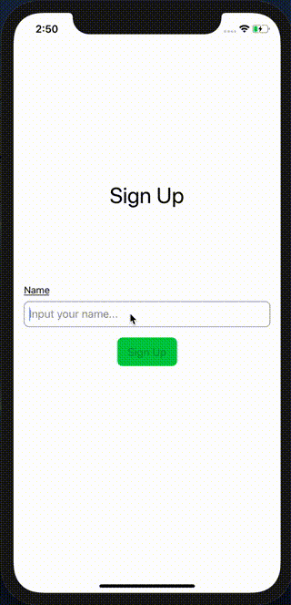

# SwiftUI-Firebase-Todo

Simple Todo application that using SwiftUI and Firebase(Authentication, Cloud Firestore)



## Requirements

- Xcode 11 beta
- iOS 13.0 beta
- SwiftUI
- bundler
- CocoaPods
- yarn

## Setup

### Install frameworks

```sh
$ git clone path/to/project
$ cd path/to/project
$ bundle install
$ bundle exec pod install
```

### Firebase Project

- Visit [Firebase console](https://console.firebase.google.com/) and create new project.
- Visit [Develop]->[Authentication] and enable `Anonymous` sign-in method.
- Visit [Develop]->[Database] and setup Cloud Firestore.

### GoogleService-Info.plist

- Create iOS app in Firebase Project with bundle ID `-.FireTodo-w-SwiftUI`
- Download `GoogleService-Info.plist` and move to `./FireTodo-w-SwiftUI/Config`


### Deploy firestore.rules

- move `firebase` directory.
- Change `.firebaserc` below:

```
{
  "projects": {
    "default": "<your-project-id>"
  }
}
```

- execute commands

```sh
$ yarn
$ yarn firebase login
$ yarn firebase deploy --only firestore:rules
```

## Todo

- [ ] Improvement data flow using Combine.
- [ ] Dismiss UserView correctly after user has signed out.

## References
- (docs): https://developer.apple.com/documentation/swiftui
- (SwiftUI tutorials): https://developer.apple.com/tutorials/swiftui/tutorials
- (Firebase setup): https://firebase.google.com/docs/ios/setup

## Communication

- If you found a bug, please open an issue. 🙇
- Also, if you have a feature request, please open an issue. 👍
- If you want to contribute, submit a pull request.💪

## License

`SwiftUI-Firebase-Todo` is under MIT license. See the LICENSE file for more info.